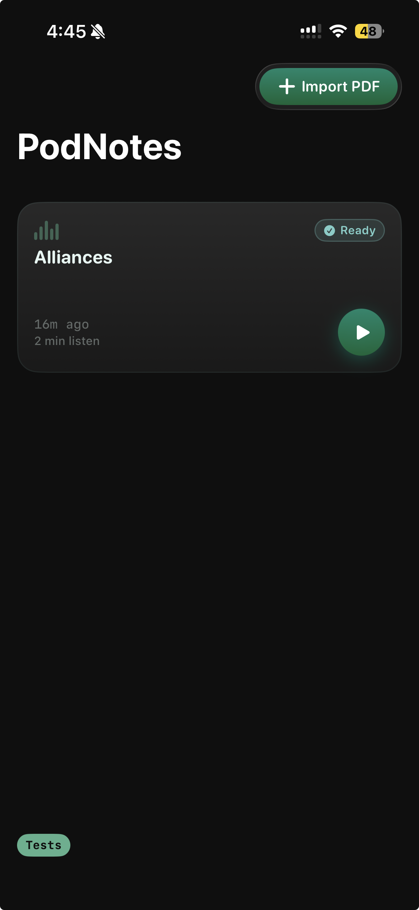
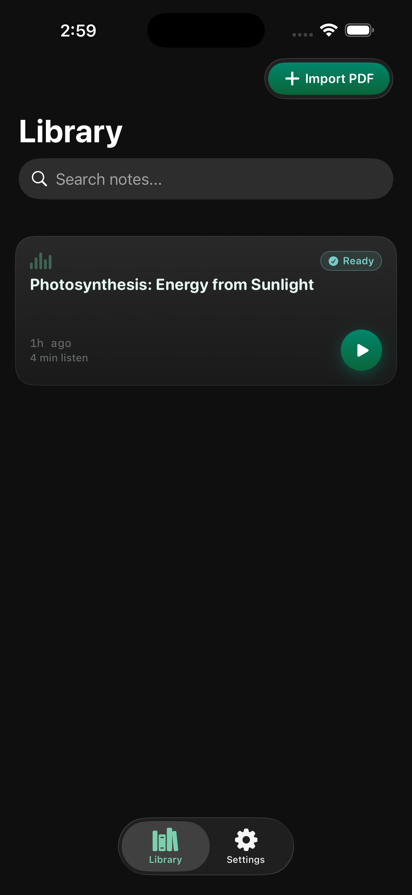
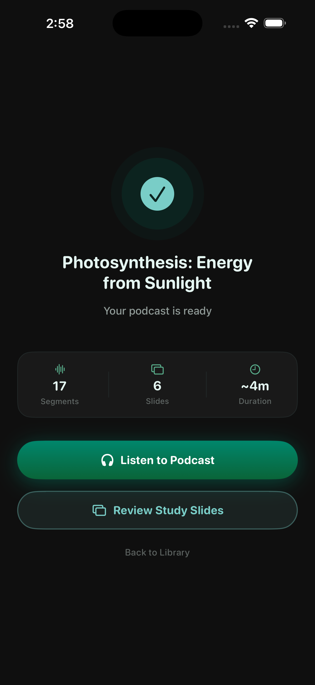
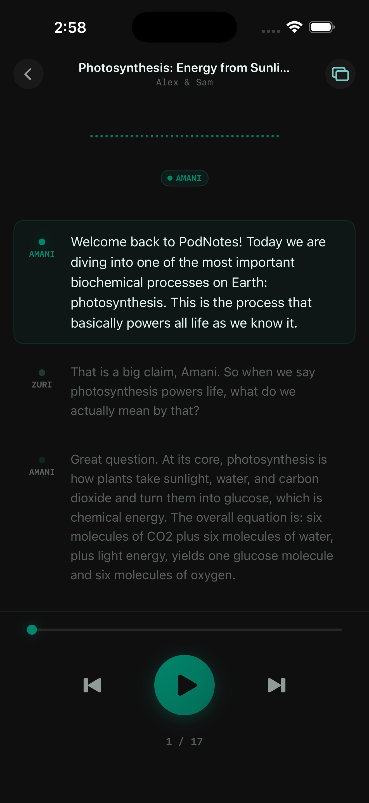
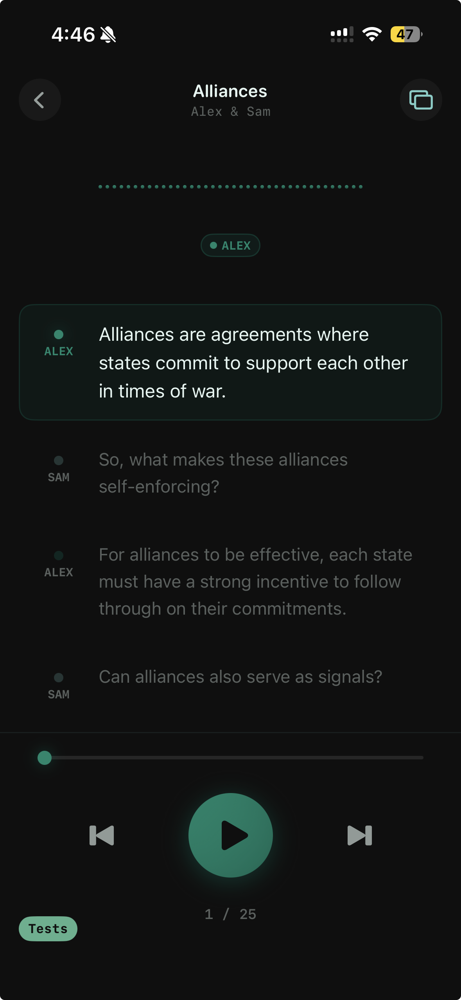
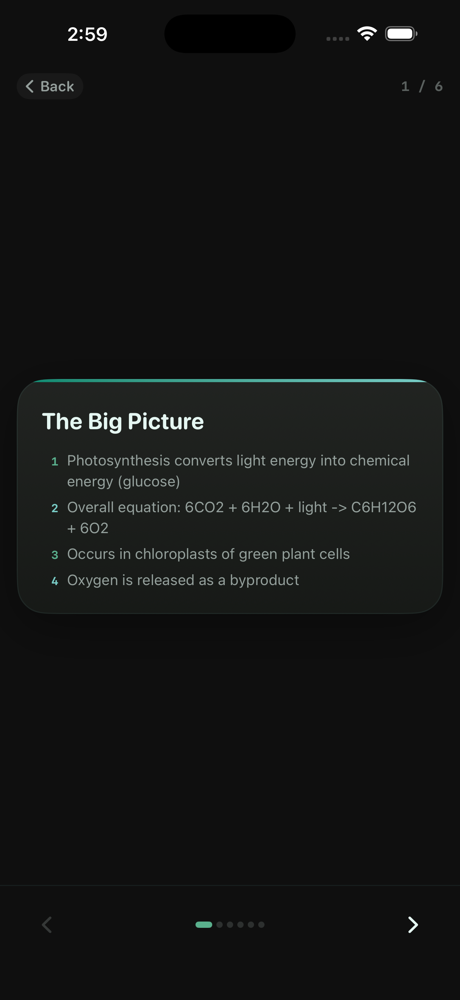
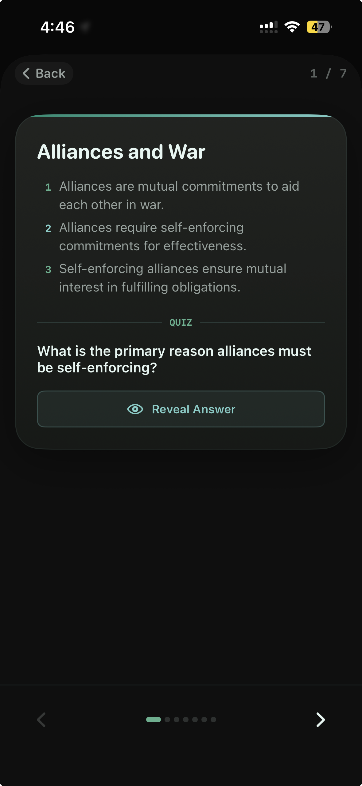
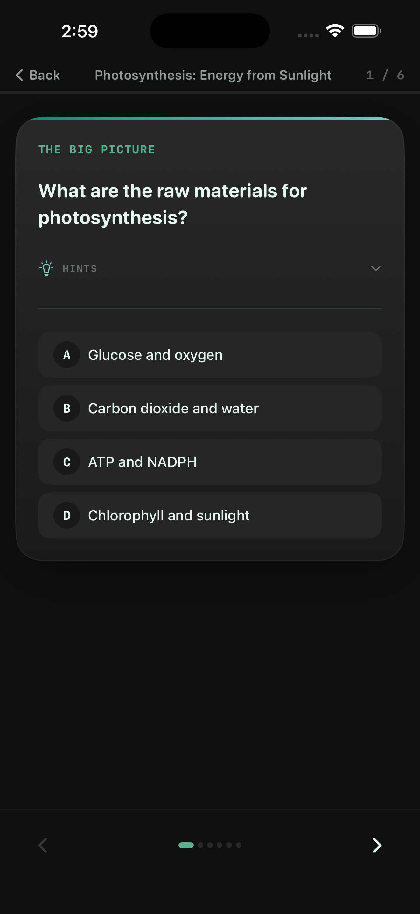

# PodNotes

An iOS app that turns a PDF into a two-host podcast, a slide deck, and quiz flashcards. Think NotebookLM, but offline. Every step runs on-device through Apple's Foundation Models framework, so there is no backend, no API keys, and no network calls.

## Swift Student Challenge

PodNotes was selected as one of the winners of Apple's [Swift Student Challenge](https://developer.apple.com/swift-student-challenge/) in 2026. The challenge asks students to submit an app built as a Swift Playgrounds app package, which is why this project ships as `PodNotes.swiftpm` (targeting iOS 26) rather than as a standard Xcode project, and why the whole flow is scoped to a short session.

Useful references:

- [Swift Student Challenge](https://developer.apple.com/swift-student-challenge/), including eligibility and submission requirements
- [Swift Playgrounds](https://www.apple.com/swift/playgrounds/), the environment app packages are built and run in
- [Foundation Models framework](https://developer.apple.com/documentation/foundationmodels), the on-device model API this app is built around

## Screens

### Library

<table>
<tr>
<td width="50%" align="center"></td>
<td width="50%" align="center"></td>
</tr>
<tr>
<td valign="top">Every imported PDF becomes a module card showing its processing status, age, and estimated listen time. Tapping play jumps straight to the podcast.</td>
<td valign="top">The library is searchable by title once more than a few modules pile up. Import is a single button that opens the system file picker.</td>
</tr>
</table>

### Processing

When the pipeline finishes it reports what was produced: dialogue segments, slides, and an estimated listen time, with direct links into either output. While it runs, the same screen shows a terminal-style log of each stage as it completes.

### Podcast

<table>
<tr>
<td width="50%" align="center"></td>
<td width="50%" align="center"></td>
</tr>
<tr>
<td valign="top">The player reads the script aloud through two distinct voices. The active turn is highlighted while earlier and upcoming turns stay visible, and the transport controls skip by segment.</td>
<td valign="top">Every turn is attributed to a host, so the transcript doubles as a readable summary when listening is not an option.</td>
</tr>
</table>

### Slides and quizzes

<table>
<tr>
<td width="50%" align="center"></td>
<td width="50%" align="center"></td>
</tr>
<tr>
<td valign="top">The same source text is condensed into a swipeable deck, each slide a topic title with three or four key points.</td>
<td valign="top">Each slide carries a generated quiz question with the answer hidden behind a reveal, for self-testing after a listen.</td>
</tr>
</table>

The Study tab turns those questions into multiple-choice cards with optional hints, working through the deck one card at a time.

## What it does

1. Import a PDF from the Library tab. Scanned pages without a text layer are detected and run through Vision OCR.
2. Extracted text is chunked and passed through an on-device generation pipeline.
3. The result is available three ways: a spoken two-host podcast with a live transcript, a swipeable slide deck, and quiz flashcards.

If Apple Intelligence is unavailable or generation fails, a deterministic fallback generator builds the podcast and slides directly from the source paragraphs so the pipeline never dead-ends.

## Pipeline

1. `PDFIngestionService` extracts text with PDFKit, falling back to Vision OCR on pages that lack a real text layer.
2. `TextChunker` splits the text into roughly 1200-word chunks, tagged with their source page range.
3. `GenerationService` generates content per chunk, or `FallbackGenerator` takes over if the on-device model is unavailable.
4. `SSMLBuilder` marks up each dialogue turn for speech, and the results are saved to a single SwiftData `StudyModule`.
5. `SpeechService`, `SlideDeckView`, and `FlashcardView` read from that module for playback, slides, and quizzes.

`GenerationService` runs one `LanguageModelSession` per call per chunk, using `@Generable` structs so the model returns typed output instead of free text:

| Call | Input | Output |
| --- | --- | --- |
| Topic extraction | Chunk text | 5-8 topics with one-sentence summaries |
| Podcast dialogue | Topics | 12-20 alternating turns between two hosts |
| Slide generation | Topics | Title, 3-4 bullets, and a quiz question per topic |

Dialogue and slides are generated concurrently per chunk. Chunks run sequentially so progress can be reported to the UI.

## Tech stack

- SwiftUI and SwiftData for UI and local persistence
- [FoundationModels](https://developer.apple.com/documentation/foundationmodels) for on-device structured generation
- PDFKit and Vision for text extraction with OCR fallback
- AVFoundation (`AVSpeechSynthesizer`) for two-voice playback with SSML

## Requirements

- Xcode 16+ or Swift Playgrounds, targeting iOS 26
- Apple Intelligence enabled for the full AI pipeline, otherwise the fallback generator is used
- Open `PodNotes.swiftpm` directly and run

## Notes

- English only for now, both in prompting and voice selection
- Speech quality depends on which system voices are installed. The app detects this and points users to Settings when only default-quality voices are available. See [docs/voice-quality-guide.md](docs/voice-quality-guide.md)

## License

MIT. See [LICENSE](LICENSE).
